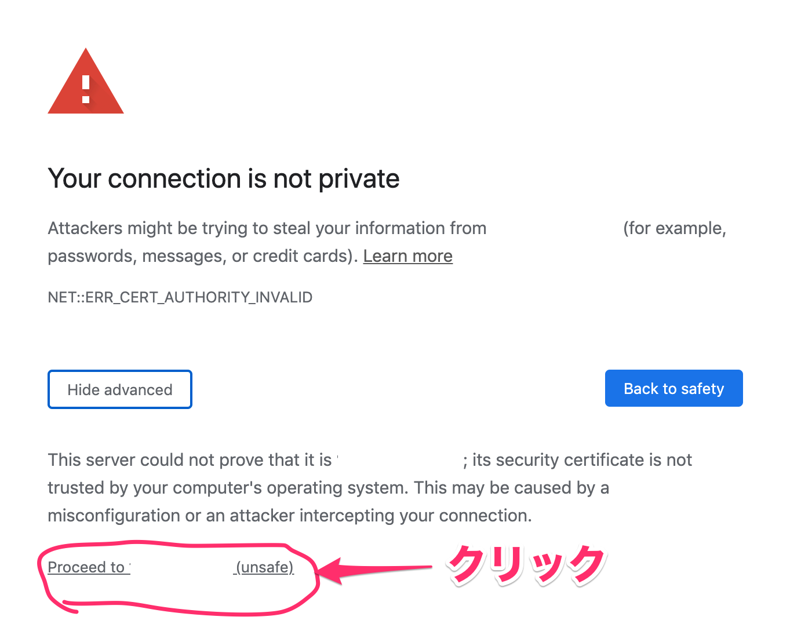
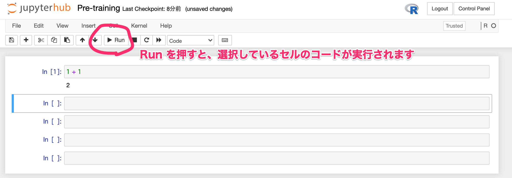

# 演習A：手順


## A00: 自分のユーザ名とパスワードを確認する

> - **ユーザ名とパスワードはmanabaに記載してあります**  
>   - [manabaのページ](https://manaba.tsukuba.ac.jp/ct/course_2438996)のコンテンツの「２日目資料」のExcelファイルを確認してください。

## A01: JupyterHub へアクセスする

> - **URLはmanabaに記載してあります**  
>   - [manabaのページ](https://manaba.tsukuba.ac.jp/ct/course_2438996)のコンテンツの「２日目資料」のExcelファイルを確認してください。

アクセスして下図のような画面が表示された場合、`ADVANCED`をクリックしてください（下図、矢印）。

- 

さらに、`Proceed to [IPアドレス] (unsafe)` をクリックします。

- 

すると、下図のようなログイン画面がでてきます。事前に配布したユーザ名とパスワードを入力して `Sign in` をクリックします。

- 

下図の画面が出たらログイン成功です。

- 

## A02: R のノートブックを開く

"New" のボタンをクリックします。

- 

"R" を選択します。

- 

新しいタブが開き、下図のように右上に "R"と書かれていたら成功です。


## A03: [Jupyter基本動作] ノートブックの名前を変更する

"Untitled" となっている部分をクリックすると、このノートブックのファイル名を変更できます。
ファイル名を "Pre-training" と変更しましょう。

- 


## A04: [Jupyter基本動作] セルについて

四角で囲まれた場所をセルと呼びます。

セルにはコードを書き込むことができます。

- 


## A05: [Jupyter基本動作] セルを増やす

"+"のボタンを押した分だけセルが増えます。

- 

## A06: [Jupyter基本動作] 実行してみる

1. いずれかのセル（どれでもいい）に `1+1` と書き込んでみましょう
2. Run を押すと、選択しているセルのコードが実行されます。
3. セルのすぐ下に、実行結果が出力されます。

- 

   1. 今の場合だと `2` と表示されるはず


## A07: ターミナルでコマンドを実行する

1. いったん「Jupyter Notebookを開いていたタブ」から「ファイルの一覧のタブ」に移動しましょう。
2. 以下の手順でターミナルを起動します。
    - `New`をクリックするとメニューが表示されます。
    - その中から`Terminal`をクリックします。
   - 
   - 

3. すると新しいタブでターミナル（黒い画面）が表示されます。

4. `ls` を実行すると、 `Pre-training.ipynb` が出力されるはずです。

```bash
ls
```

- 

## A08: Jupyter Hub からファイルをダウンロードする

1. 「Jupyter Notebookを開いていたタブ」に戻ろう
2. Jupyter Hub上のメニューから `File > Download as > Notebook (.ipynb)` を選択すると、実行結果をJupyter notebook形式でダウンロードできる
3. 自分のパソコンに `Pre-train.ipynb` という名前のファイルが保存されていることを確認する
